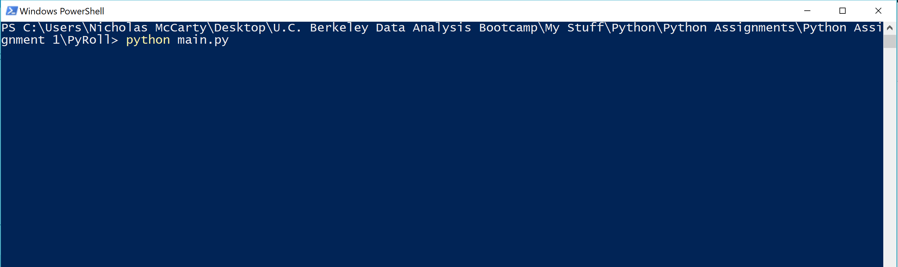

# Python Assignment 1 | Py Me Up, Charlie

## PyPoll

* Given a dataset [election_data.csv](https://ucb.bootcampcontent.com/UCB-Coding-Bootcamp/UCBBERK201902DATA3/blob/master/02-Homework/03-Python/Instructions/PyPoll/Resources/election_data.csv) composed of three columns (`Voter ID`, `County`, and `Candidate`), your task is to create a Python script that analyzes the votes and calculates each of the following:

  * The total number of votes cast

  * A complete list of candidates who received votes

  * The percentage of votes each candidate won

  * The total number of votes each candidate won

  * The winner of the election based on popular vote.

* As an example, your analysis should look similar to the one below:

  ```text
  Election Results
  -------------------------
  Total Votes: 3521001
  -------------------------
  Khan: 63.000% (2218231)
  Correy: 20.000% (704200)
  Li: 14.000% (492940)
  O'Tooley: 3.000% (105630)
  -------------------------
  Winner: Khan
  -------------------------
  ```

* In addition, your final script should both print the analysis to the terminal and export a text file with the results.

### End Result

A script ('''main.py''') that you are able to run from the command line to produce a pre-defined output ('''output.txt''') in the working directory (the folder containing the dataset, script, and output).


